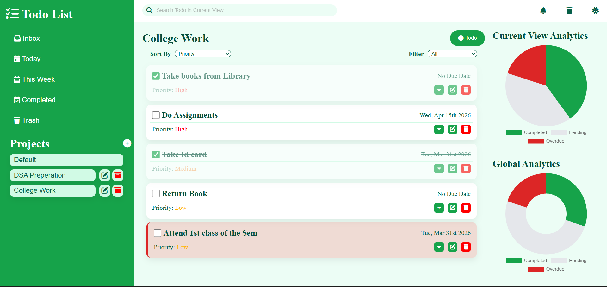
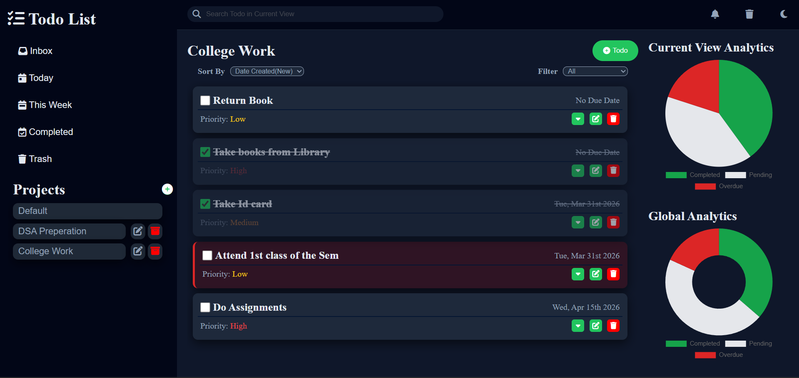

# 📝 Todo List App

A fully-featured Todo List application built as part of **The Odin Project** curriculum.
This project focuses on modular JavaScript, state management, and dynamic UI rendering.




---

## 🚀 Live Demo

👉 https://abhirup-2005.github.io/todo-list/

---

## 📌 Features

### ✅ Core Functionality

* Create, edit, and delete todos
* Organize todos into projects
* Mark tasks as completed
* Add due dates, priority levels, notes, and checklists

### 📊 Smart Views

* Inbox (all tasks)
* Today (due today)
* Upcoming (future tasks)
* Completed tasks
* Trash (deleted items)

### 🔍 Productivity Tools

* Search todos in real-time
* Sort by:

  * Date created
  * Due date
  * Priority
  * Title
* Filter by:

  * Completed / Pending
  * Overdue
  * Priority levels

### 🗑️ Trash System

* Soft delete (recoverable)
* Permanent delete
* Restore todos & projects

### 📈 Analytics

* Current view statistics (pie chart)
* Global statistics (doughnut chart)
* Built using Chart.js 

### 🎨 UI/UX

* Clean, responsive layout
* Dark / Light theme toggle
* Expandable todo details
* Smooth sidebar interactions

---

## 🏗️ Project Architecture

This project follows a **modular architecture** separating logic, UI, and state:

```
src/
├── logic/        # Business logic (todos, projects)
├── models/       # Data models
├── state/        # Central state management
├── storage/      # LocalStorage handling
├── ui/           # UI rendering & interactions
├── index.js      # Entry point
├── style.css     # Styling
└── template.html # HTML structure
```

### 🔧 Key Concepts Used

* ES6 Modules
* Separation of concerns
* State-driven UI rendering
* Event delegation
* LocalStorage persistence 
* Factory functions for models  

---

## ⚙️ How It Works

* The app initializes via `initUI()` 
* Data is loaded from localStorage
* UI updates dynamically based on current view
* Sorting & filtering are applied before rendering 
* All changes persist automatically

---

## 🛠️ Tech Stack

* **JavaScript (ES6 Modules)**
* **Webpack**
* **HTML5**
* **CSS3 (Custom properties + responsive layout)**
* **Chart.js**
* **date-fns**

---

## 📦 Installation & Setup

Clone the repo:

```bash
git clone https://github.com/your-username/todo-list.git
cd todo-list
```

Install dependencies:

```bash
npm install
```

Run development server:

```bash
npm run dev
```

Build for production:

```bash
npm run build
```

---

## 🎯 Learning Outcomes

This project helped reinforce:

* Structuring large JavaScript applications
* Managing application state effectively
* DOM manipulation at scale
* Building reusable UI components
* Handling complex user interactions
* Clean code organization

---

## 🔮 Future Improvements

* Drag & drop todos
* Due date reminders / notifications
* Cloud sync
* Mobile optimization improvements
* User authentication

---

## 🙌 Acknowledgements

* [The Odin Project](https://www.theodinproject.com/)
* Chart.js for analytics
* date-fns for date handling

---

## 📜 License

This project is open-source and available under the MIT License.

---

## 💡 Author

**Abhirup Sengupta**
GitHub: https://github.com/abhirup-2005

---

⭐ If you like this project, consider giving it a star!
